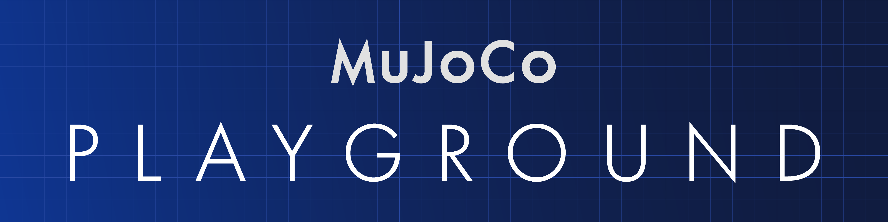

# MuJoCo Playground

<h1>
  <a href="#"></a>
</h1>

A comprehensive suite of GPU-accelerated environments for robot learning research and sim-to-real, built with [MuJoCo MJX](https://github.com/google-deepmind/mujoco/tree/main/mjx).

Features include:

- Classic control environments from `dm_control` reimplemented in MJX.
- Quadruped and bipedal locomotion environments.
- Non-prehensile and dexterous manipulation environments.
- Vision-based support available via [Madrona-MJX](https://github.com/shacklettbp/madrona_mjx).

For more details, checkout the project [website](https://playground.mujoco.org/).

## Installation

You can install MuJoCo Playground directly from PyPI:

```sh
pip install playground
```

### From Source

> [!IMPORTANT]
> Requires Python 3.9 or later.

1. `pip install -U "jax[cuda12]"`
    * Verify GPU backend: python -c "import jax; print(jax.default_backend())" should print gpu
2. `git clone git@github.com:google-deepmind/mujoco_playground.git`
3. `cd mujoco_playground`
4. `uv pip install -e ".[all]"`

#### Madrona-MJX (optional)

For vision-based environments, please refer to the installation instructions in the [Madrona-MJX](https://github.com/shacklettbp/madrona_mjx?tab=readme-ov-file#installation) repository.

## Getting started

To try out MuJoCo Playground locally on a simple locomotion environment, run the following:

```py
import jax
import jax.numpy as jp
from mujoco_playground import registry

env = registry.load('Go1JoystickFlatTerrain')
state = jax.jit(env.reset)(jax.random.PRNGKey(0))
print(state.obs)
state = jax.jit(env.step)(state, jp.zeros(env.action_size))
print(state.obs)
```

For detailed tutorials on using MuJoCo Playground, see:

1. Intro. to the Playground with DM Control Suite [](https://colab.research.google.com/github/google-deepmind/mujoco_playground/blob/main/learning/notebooks/dm_control_suite.ipynb)
2. Locomotion Environments [](https://colab.research.google.com/github/google-deepmind/mujoco_playground/blob/main/learning/notebooks/locomotion.ipynb)
3. Manipulation Environments [](https://colab.research.google.com/github/google-deepmind/mujoco_playground/blob/main/learning/notebooks/manipulation.ipynb)

For tutorials on using MuJoCo Playground with Madrona-MJX, see:

1. Training CartPole from Vision [](https://colab.research.google.com/github/google-deepmind/mujoco_playground/blob/main/learning/notebooks/training_vision_1.ipynb)
2. Robotic Manipulation from Vision [](https://colab.research.google.com/github/google-deepmind/mujoco_playground/blob/main/learning/notebooks/training_vision_2.ipynb)

## How can I contribute?

Get started by installing the library and exploring its features! Found a bug? Report it in the issue tracker. Interested in contributing? If you’re a developer with robotics experience, we’d love your help—check out the [contribution guidelines](CONTRIBUTING) for more details.

## Citation

If you use Playground in your scientific works, please cite it as follows:

```bibtex
@misc{mujoco_playground_2025,
  title = {MuJoCo Playground: An open-source framework for GPU-accelerated robot learning and sim-to-real transfer.},
  author = {Zakka, Kevin and Tabanpour, Baruch and Liao, Qiayuan and Haiderbhai, Mustafa and Holt, Samuel and Luo, Jing Yuan and Allshire, Arthur and Frey, Erik and Sreenath, Koushil and Kahrs, Lueder A. and Sferrazza, Carlo and Tassa, Yuval and Abbeel, Pieter},
  year = {2025},
  publisher = {GitHub},
  url = {https://github.com/google-deepmind/mujoco_playground}
}
```

## License and Disclaimer

The texture used in the rough terrain for the locomotion environments is from [Polyhaven](https://polyhaven.com/a/rock_face) and licensed under [CC0](https://creativecommons.org/public-domain/cc0/).

All other content in this repository is licensed under the Apache License, Version 2.0. A copy of this license is provided in the top-level [LICENSE](LICENSE) file in this repository. You can also obtain it from https://www.apache.org/licenses/LICENSE-2.0.

This is not an officially supported Google product.
