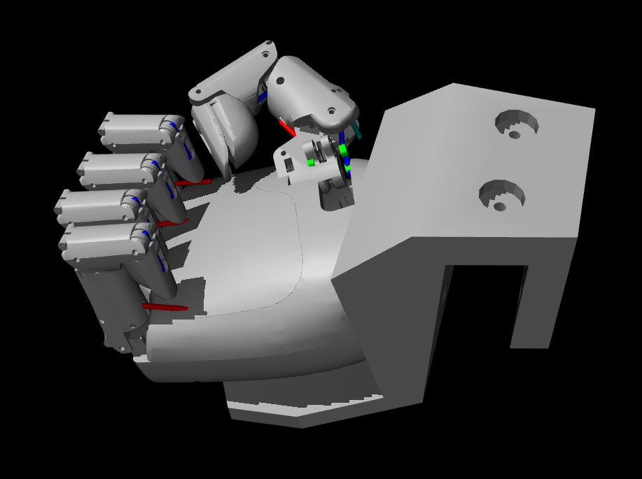
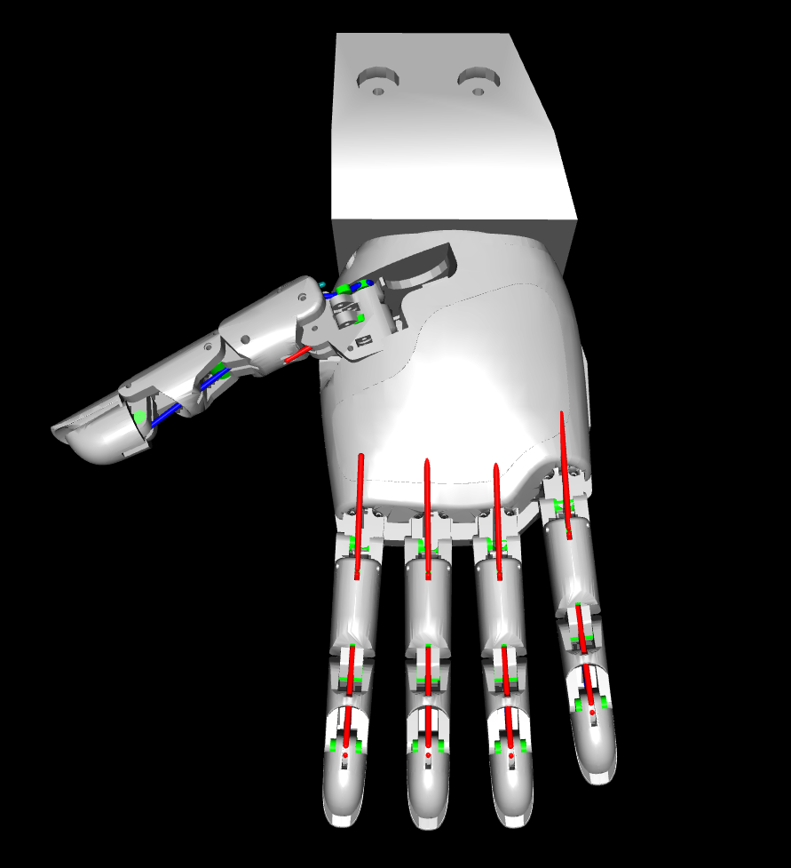
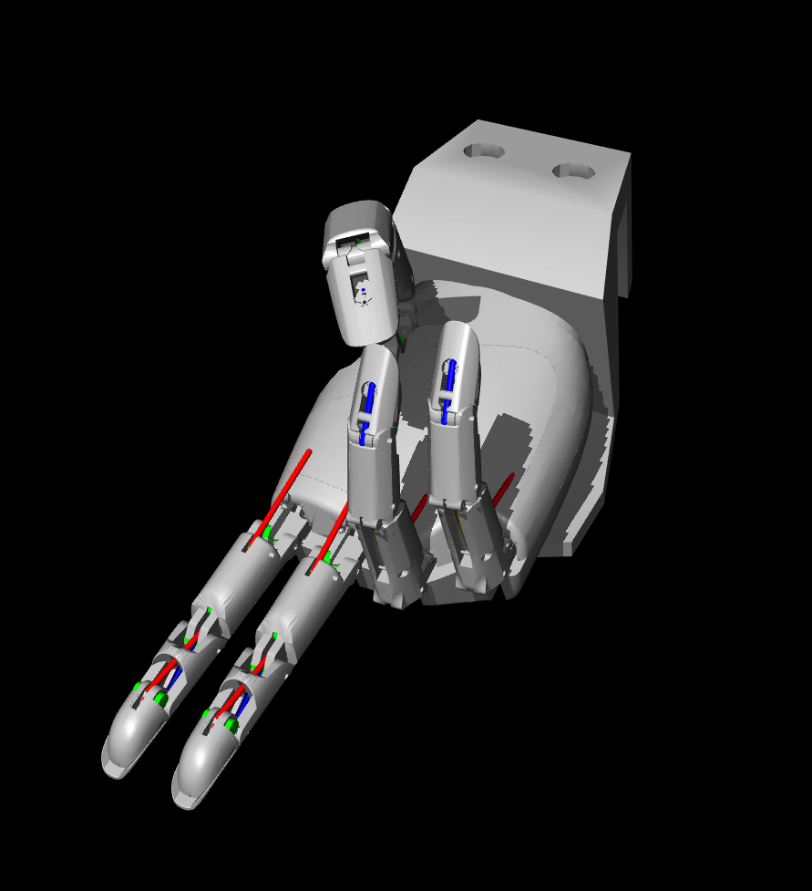
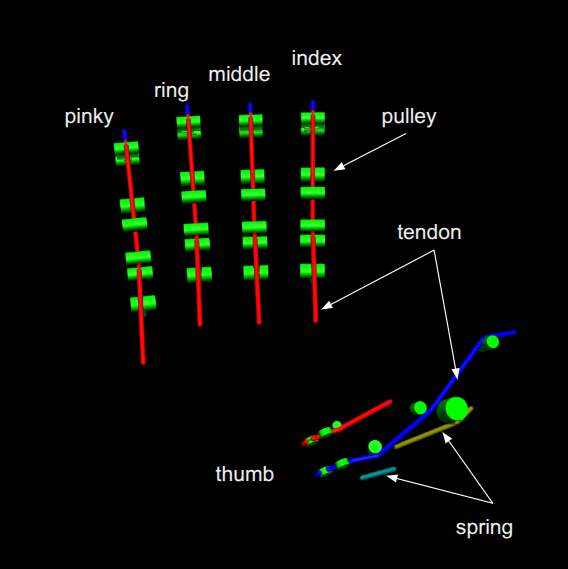
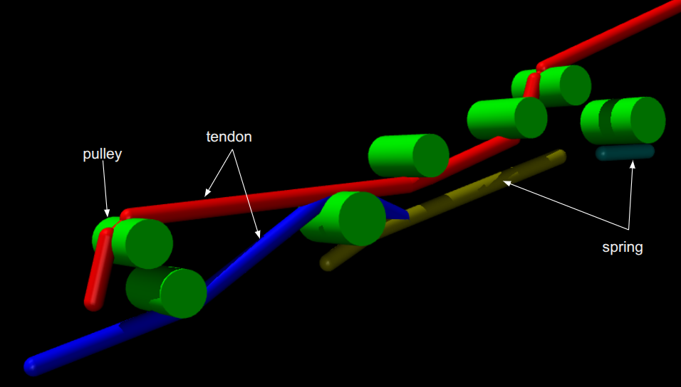

# Tetheria Aero Hand Open with Tendon-Driven Actuation

This directory introduces a tendon-driven manipulation example that extends MuJoCo Playground with support for tendon-level control and observation in reinforcement learning tasks.

The model is adapted from the [Tetheria Aero Hand Open](https://docs.tetheria.ai/), featuring a physically accurate tendon system that emulates cable-driven actuation. In this setup, both the policy inputs and observations are defined in the tendon space, providing a complete example of training and deploying tendon-driven controllers and under-actuated fingers in MuJoCo.

An overview of the hand is shown below:

|  |  |  |
|------------------------|------------------------|------------------------|


## 1. Tendon-Driven MuJoCo Model

### 1.1 Modeling

The mechanical design is derived from URDF files, ensuring accurate representation of the real hand structure. The actuation system in the simulator models the cable design in the real hand through three key components:

#### 1.1.1 Tendon Drives
The tendons drive the hand to close the fingers and control the thumbs. These are modeled as spatial tendons in MuJoCo that follow the exact routing paths of the real cables.

#### 1.1.2 Springs
The springs, which are also modeled by tendon components in MuJoCo, provide the forces to pull the fingers in the backward direction. This creates the restoring forces necessary for finger extension.

#### 1.1.3 Pulleys
The pulleys, which are modeled as cylinders, organize the cables and springs to ensure they are routed in a similar way to the real hand. Careful placement of these pulleys ensures accurate tendon routing.

| front view| close-up of index|
|------------------------|------------------------|
|  | 

### 1.2 Parameters

#### 1.2.1 Mechanical Parameters
- **Joint limits, mass, and inertia**: Come directly from URDF and are accurate to the real hand
- **Pulley placement**: Positioned precisely where they are placed in the real hand, ensuring cable and spring routes match the real system
- **Validation**: The range of tendon between fully open and fully closed fingers in simulation (0.0459454) closely matches the real hand (0.04553) without manual adjustment

#### 1.2.2 Tendon and Spring Specifications
- **Tendon properties**: Use the same specifications as those in the real hand
- **Spring properties**: Match real hand specifications, except for the spring on the DIP joint, which is adjusted as a compromise to achieve similar joint space behavior as the real hand

#### 1.2.3 Control Parameters
All remaining parameters, including:
- Joint damping values
- Actuator gains
- Joint-specific damping coefficients

These are fine-tuned to satisfy both similar joint behaviors in simulation and the real world.


## 2. Training your own policy

We introduce a **z-axis rotation task** for the **Tetheria Aero Hand Open**, optimized using the following reward formulation:

$$
\text{reward} = 1.0 \times \text{angular velocity}
               - 1.0 \times \text{action rate}
               + \text{termination} (-100.0)
$$

The optimization variables include the **tendon lengths** and the **thumb abduction joint**, which correspond to the real hand’s actuation system.
This setup ensures that the same control inputs and sensory data can be directly applied for **sim-to-real deployment** on the physical Tetheria Aero Hand Open.


To train policies for the Tetheria Hand:

```bash

# Run the training script
python learning/train_jax_ppo.py --env_name TetheriaCubeRotateZAxis
```

Although the reward curves from different training runs may vary due to stochasticity in the learning process, they consistently **converge toward a positive reward**.

## 3. Running a pretrained policy


To test trained policies in simulation:

```bash
# Run the simulation rollout script
python learning/train_jax_ppo.py   --env_name TetheriaCubeRotateZAxis   --play_only   --load_checkpoint_path path/to/checkpoints
```

This will:
- Load the trained policy
- Run episodes in the MuJoCo simulation
- Display the hand performing manipulation tasks

## File Structure

### Core Implementation
- **`tetheria_hand_tendon_constants.py`** - Constants and configuration
- **`rotate_z.py`** - Cube rotation task implementation

### XML Models
- **`xmls/right_hand.xml`** - Main hand model with tendon system
- **`xmls/scene_mjx_cube.xml`** - Manipulation scene
- **`xmls/reorientation_cube.xml`** - Cube reorientation task

## Key Features

- **Accurate tendon modeling**: Direct translation from real hand cable system
- **Precise pulley placement**: Matches real hand routing exactly
- **Validated parameters**: Tendon ranges match real hand within 0.1%

---

*This implementation provides a high-fidelity tendon-driven hand model that closely matches the real robotic hand, enabling effective sim-to-real transfer for manipulation tasks.*

## Acknowledgements
Our code is built upon
- MuJoCo playground - https://github.com/google-deepmind/mujoco_playground